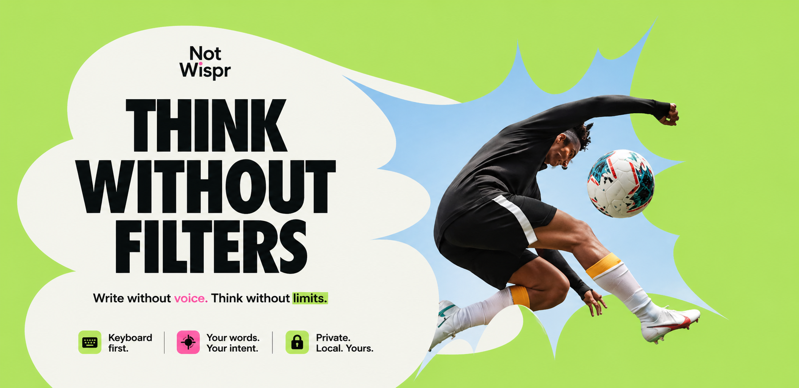

# Openwhisp



Voice to text on your Mac. Hold **Fn**, speak, release — your words are transcribed, polished, and pasted right where you need them. Run it fully local with Ollama, or bring your own OpenRouter key for cloud rewrites and on-the-fly image generation.

This is a fork of [giusmarci/openwhisp](https://github.com/giusmarci/openwhisp) that adds:
- **Cloud rewrite via OpenRouter** (BYOK) — skip the local 10 GB model download
- **Image agent** — say "create an image of …" mid-dictation and the app generates one and pastes the URL
- **BYO Supabase storage** for the generated images

## How it works

1. **Hold Fn** — Openwhisp starts listening
2. **Speak** — your voice is captured locally
3. **Release Fn** — Whisper transcribes locally, the rewrite engine polishes the text (Ollama or OpenRouter), and the result is pasted into the active app
4. **Image intent** — if you say "create an image about …" the agent classifies the intent, generates an image via OpenRouter, uploads to your Supabase bucket, and pastes the public URL

Speech-to-text always runs locally via [Whisper](https://github.com/openai/whisper). Text rewriting runs either locally via [Ollama](https://ollama.com) or in the cloud via [OpenRouter](https://openrouter.ai), your choice.

## Features

- **Speech stays local** — Whisper transcription never leaves your Mac
- **Pick your engine** — local (Ollama) or cloud (OpenRouter), switchable anytime
- **Styles** — Conversation and Vibe Coding
- **Enhancement levels** — No Filter, Soft, Medium, High
- **Intent resolution** — "make it white… actually, black" → resolves to your final intent
- **Image agent** — detects image-generation requests during dictation and renders + uploads inline
- **BYOK** — your OpenRouter key, your Supabase bucket; nothing routes through a hosted service
- **Auto-paste** into the active app
- **Setup wizard** for permissions, engine selection, and models

## Styles

| Style | Use case |
|-------|----------|
| **Conversation** | Messages, emails, notes, everyday writing |
| **Vibe Coding** | Developer communication — translates casual speech into proper engineering language |

Each style has four enhancement levels: **No Filter**, **Soft**, **Medium**, and **High**.

## Requirements

- macOS (Apple Silicon recommended)
- One of:
  - [Ollama](https://ollama.com/download/mac) for local rewrites (~10 GB disk for the model), or
  - An [OpenRouter API key](https://openrouter.ai/keys) for cloud rewrites (pennies per dictation)
- Optional: a [Supabase project](https://supabase.com/dashboard) with a public bucket if you want the image agent

## Getting started

```bash
git clone git@github.com:HUSAM-07/notwhispr.git
cd notwhispr
npm install
npm run build:native
npm run dev
```

The setup wizard walks you through:

1. **Engine** — pick Local (Ollama) or Cloud (OpenRouter); paste your OpenRouter key if you chose cloud
2. **Speech model** — downloads Whisper Base Multilingual (~150 MB) automatically
3. **Text model** — pick from your installed Ollama models, or pick an OpenRouter model from the curated list
4. **Permissions** — microphone, Accessibility, and Input Monitoring

After setup, click into any text field, hold **Fn**, speak, release. The polished text is pasted into the field. If no field is focused, the text is copied to your clipboard.

### Enabling the image agent

1. Models page → **Image AI (OpenRouter)** card → toggle **Enable image agent**
2. Models page → **Image Storage** card → paste your Supabase project URL, secret key, and a public bucket name (e.g. `openflow`)
3. Dictate something with an image trigger phrase: "create an image of a cat doing backflips"
4. The image is generated, uploaded to your bucket, and the public URL is pasted alongside your text

The Supabase bucket must exist and be public. The secret key is used only for uploads and is stored locally in `userData/settings.json`, never sent anywhere except your own Supabase project.

## Default models

| Purpose | Default | Notes |
|---|---|---|
| Speech-to-text | `onnx-community/whisper-base` | ~150 MB, runs locally |
| Text (Ollama) | `gemma4:e4b` | ~9.6 GB |
| Text (OpenRouter) | `google/gemini-2.5-flash-lite` | ~$0.10/M in, $0.40/M out |
| Image (OpenRouter) | `google/gemini-2.5-flash-image` | "Nano Banana" |

You can switch any of them from the Models page.

## Tech stack

- **Electron** + **React** + **TypeScript** — desktop shell and UI
- **@huggingface/transformers** — local Whisper inference
- **Ollama** — local LLM inference via API
- **OpenRouter** — cloud LLM + image generation
- **Supabase Storage** — public CDN for generated images
- **Swift** — native macOS helper for Fn key listening, focus detection, and paste simulation
- **electron-vite** — build tooling

## Building for distribution

```bash
npm run package
```

Builds the Electron app, compiles the Swift helper, and packages everything into a `.dmg` and `.zip` in the `release/` directory.

## Project structure

```
src/
  main/                  # Electron main process
    dictation.ts           # Transcription + rewrite + image agent pipeline
    ollama.ts              # Ollama API client + auto-launch
    openrouter.ts          # OpenRouter chat + image generation client
    image-agent.ts         # Intent classifier + image orchestrator
    supabase-storage.ts    # Public-bucket upload helper (BYO settings)
    config.ts              # .env loader for developer fallback
    prompts.ts             # Global rules + style + level prompt matrix
    settings.ts            # Settings persistence
    windows.ts             # Window creation and positioning
  renderer/              # React UI
    App.tsx                # Sidebar layout, pages, setup wizard, overlay
    styles.css             # Complete styling
    audio-recorder.ts      # Web Audio recorder with level metering
  preload/               # Electron preload bridge
  shared/                # Shared types and constants
swift/
  OpenWhispHelper.swift  # Native macOS helper
```

## License

MIT — same as the upstream project. Original work by [giusmarci](https://github.com/giusmarci/openwhisp).
